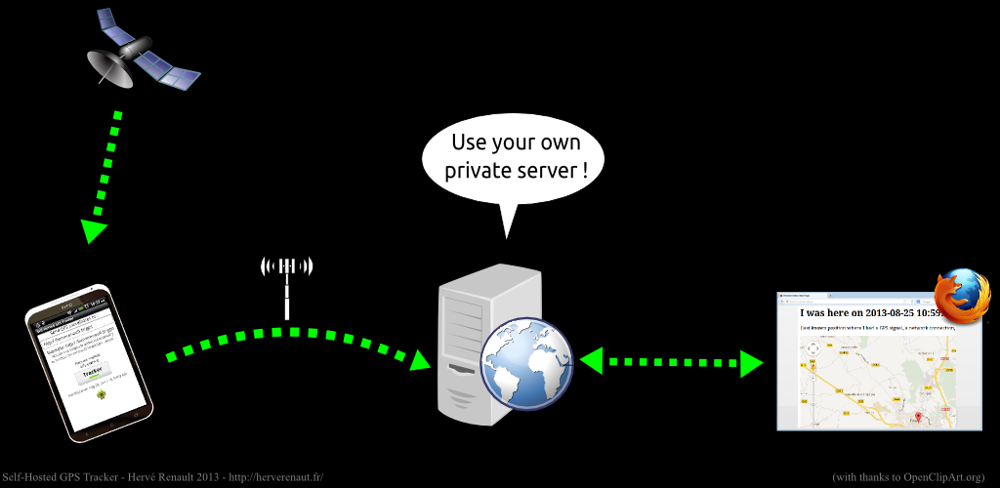

iTracker App
=======================

This small Android app sends your GPS coordinates to *your* server. It's your data, do what *you* want with it.

##How it works :

You need a self-hosted web server on which you're allowed to install this kind of script which records GPS coordinates (latitude, longitude) : https://github.com/brenohq/iTracker/blob/master/server-side/gps.php

=======================

##Important

This app is NOT meant to be a stealth tracker, or to be forced upon a user. So, please don't ask me how to hide it from the user, or how to prevent the user from closing the app.

##Demo

I put a demo on http://brenohq.com/server/i-am-here.html
To see your position on this page, enter http://brenohq.com/gps.php in the app on your phone (or tablet). It's an anonymous URL, so if you're not the only one doing it, you may see the location of another anonymous user.

Side-note: There are plenty of apps which do the same, for example Open GPS Tracker. But I wanted an app
* which sends my position to my server, and only my server
* which does not download any map on my phone and thus does not go over my 3G plan
* the most simple ever : just enter URL, enable 3G and GPS and go !

And then, I wanted to do it just for fun. This is not a product, I don't sell it, there's no ad. It's only code sharing. Enjoy.
